# **Advanced Geomechanics Coursework 1**
  
## Introduction


In this report the the material parameters of a a classical elastic perfectly plastic Mohr-Coulomb model for dry sands are calculated using intermediate solid mechanics theory and material triaxial tests data. Furthermore the relationship of of the collapse load and the angle at which this force acts are investigated for a shallow foundation subjected to an external load.  


## Problem Brief


Determine the material parameters of the classical elastic perfectly plastic Mohr-Coulomb model for dry sands using the data (shown below) from the corresponding material triaxial tests (Figure 1). The tests were performed with * *=100 and 200 kPa, respectively. The *F-** *failure envelope for the shallow foundation shown in Figure 2 is estimated using the limit analysis with the calculated material parameters


```matlab:Code
[inputdat,optumdat]=trialtestdat0;
printdat(inputdat)
```


```text:Output
             Test 1
-100.00000  -100.00000   0.00000    0.00000
-100.00000  -110.00017   0.00008   -0.00033
-100.00000  -120.00034   0.00017   -0.00067
-100.00000  -130.00052   0.00025   -0.00100
-100.00000  -140.00069   0.00033   -0.00133
-100.00000  -150.00086   0.00042   -0.00167
-100.00000  -160.00104   0.00050   -0.00200
-100.00000  -170.00121   0.00058   -0.00233
-100.00000  -180.00138   0.00067   -0.00267
-100.00000  -190.00155   0.00075   -0.00300
-100.00000  -200.00172   0.00083   -0.00333
-100.00000  -210.00190   0.00092   -0.00367
-100.00000  -220.00207   0.00100   -0.00400
-100.00000  -230.00224   0.00108   -0.00433
-100.00000  -240.00242   0.00117   -0.00467
-100.00000  -250.00259   0.00125   -0.00500
-100.00000  -260.00276   0.00133   -0.00533
-100.00000  -270.00293   0.00142   -0.00567
-100.00000  -280.00311   0.00150   -0.00600
-100.00000  -290.00328   0.00165   -0.00633
-100.00000  -295.00000   0.00183   -0.00667
-100.00000  -298.00000   0.00220   -0.00700
-100.00000  -300.00350   0.00267   -0.00733
-100.00000  -300.00347   0.00317   -0.00767
-100.00000  -300.00345   0.00367   -0.00800
-100.00000  -300.00343   0.00417   -0.00833
-100.00000  -300.00340   0.00467   -0.00867
-100.00000  -300.00338   0.00517   -0.00900
-100.00000  -300.00336   0.00567   -0.00933
-100.00000  -300.00334   0.00617   -0.00967
-100.00000  -300.00332   0.00667   -0.01000
             Test 2
-200.00000  -199.99999   0.00000    0.00000
-200.00000  -220.00018   0.00017   -0.00067
-200.00000  -240.00035   0.00033   -0.00133
-200.00000  -260.00052   0.00050   -0.00200
-200.00000  -280.00069   0.00067   -0.00267
-200.00000  -300.00085   0.00083   -0.00333
-200.00000  -320.00103   0.00100   -0.00400
-200.00000  -340.00119   0.00117   -0.00467
-200.00000  -360.00137   0.00133   -0.00533
-200.00000  -380.00155   0.00150   -0.00600
-200.00000  -400.00172   0.00167   -0.00667
-200.00000  -420.00189   0.00183   -0.00733
-200.00000  -440.00207   0.00200   -0.00800
-200.00000  -460.00224   0.00217   -0.00867
-200.00000  -480.00240   0.00233   -0.00933
-200.00000  -500.00257   0.00250   -0.01000
-200.00000  -520.00276   0.00267   -0.01067
-200.00000  -540.00291   0.00283   -0.01133
-200.00000  -560.00309   0.00300   -0.01200
-200.00000  -580.00326   0.00317   -0.01267
-200.00000  -587.00000   0.00369   -0.01333
-200.00000  -595.00000   0.00432   -0.01399
-200.00000  -600.00484   0.00532   -0.01466
-200.00000  -600.00487   0.00633   -0.01533
-200.00000  -600.00489   0.00733   -0.01600
-200.00000  -600.00492   0.00833   -0.01667
-200.00000  -600.00494   0.00933   -0.01733
-200.00000  -600.00495   0.01034   -0.01800
-200.00000  -600.00497   0.01134   -0.01867
-200.00000  -600.00499   0.01234   -0.01934
-200.00000  -600.00501   0.01334   -0.02001
```


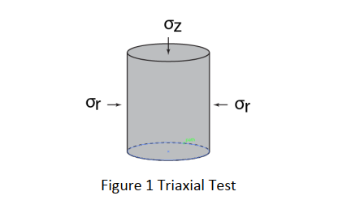


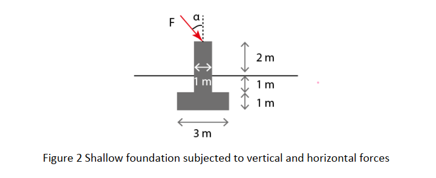


  
## Question 1 


***"Draw the p-****** and q-****** curve for both cases and determine the material parameters K and G;"***


**Solution Procedure**


Before embarking upon computations or make any further progress, it should be said, to avoid unnecessary confusion from the readers part that unless otherwise stated by the author throughout this sections of this report compressive stresses are taken as negative and tensile stress as positive. To solve the problem, first from intermediate solid mechanics theory it is known that , , , and  for a given stress condition or stress configuration. Hence extracting a row of data (in other words a row of data with index ) from the available triaxial tests datasets, the variables of interest can be calculated by making use of the following formulas:


 


Which through a programming language like MATLAB, this can easily be computed as:


```matlab:Code
[p,e_p,q,e_q]=invcalcfunc(inputdat);
```


```text:Output
                    Test 1
-100.00000   0.00000       0.00000        0.00000
-103.33339  -0.00017     -10.00017       -0.00028
-106.66678  -0.00033     -20.00034       -0.00056
-110.00017  -0.00050     -30.00052       -0.00083
-113.33356  -0.00067     -40.00069       -0.00111
-116.66695  -0.00083     -50.00086       -0.00139
-120.00035  -0.00100     -60.00104       -0.00167
-123.33374  -0.00117     -70.00121       -0.00194
-126.66713  -0.00133     -80.00138       -0.00222
-130.00052  -0.00150     -90.00155       -0.00250
-133.33391  -0.00167    -100.00172       -0.00278
-136.66730  -0.00183    -110.00190       -0.00306
-140.00069  -0.00200    -120.00207       -0.00333
-143.33408  -0.00217    -130.00224       -0.00361
-146.66747  -0.00233    -140.00242       -0.00389
-150.00086  -0.00250    -150.00259       -0.00417
-153.33425  -0.00267    -160.00276       -0.00444
-156.66764  -0.00283    -170.00293       -0.00472
-160.00104  -0.00300    -180.00311       -0.00500
-163.33443  -0.00303    -190.00328       -0.00532
-165.00000  -0.00301    -195.00000       -0.00566
-166.00000  -0.00260    -198.00000       -0.00613
-166.66783  -0.00200    -200.00350       -0.00667
-166.66782  -0.00133    -200.00347       -0.00722
-166.66782  -0.00067    -200.00345       -0.00778
-166.66781  -0.00000    -200.00343       -0.00833
-166.66780   0.00067    -200.00340       -0.00889
-166.66779   0.00133    -200.00338       -0.00944
-166.66779   0.00200    -200.00336       -0.01000
-166.66778   0.00267    -200.00334       -0.01056
-166.66777   0.00333    -200.00332       -0.01111
                    Test 2
-200.00000   0.00000       0.00001        0.00000
-206.66673  -0.00033     -20.00018       -0.00056
-213.33345  -0.00067     -40.00035       -0.00111
-220.00017  -0.00100     -60.00052       -0.00167
-226.66690  -0.00133     -80.00069       -0.00222
-233.33362  -0.00167    -100.00085       -0.00278
-240.00034  -0.00200    -120.00103       -0.00333
-246.66706  -0.00233    -140.00119       -0.00389
-253.33379  -0.00267    -160.00137       -0.00444
-260.00052  -0.00300    -180.00155       -0.00500
-266.66724  -0.00333    -200.00172       -0.00556
-273.33396  -0.00367    -220.00189       -0.00611
-280.00069  -0.00400    -240.00207       -0.00667
-286.66741  -0.00433    -260.00224       -0.00722
-293.33413  -0.00467    -280.00240       -0.00778
-300.00086  -0.00500    -300.00257       -0.00833
-306.66759  -0.00533    -320.00276       -0.00889
-313.33430  -0.00567    -340.00291       -0.00944
-320.00103  -0.00600    -360.00309       -0.01000
-326.66775  -0.00633    -380.00326       -0.01056
-329.00000  -0.00596    -387.00000       -0.01135
-331.66667  -0.00535    -395.00000       -0.01221
-333.33495  -0.00401    -400.00484       -0.01332
-333.33496  -0.00268    -400.00487       -0.01444
-333.33496  -0.00134    -400.00489       -0.01555
-333.33497  -0.00000    -400.00492       -0.01666
-333.33498   0.00133    -400.00494       -0.01778
-333.33498   0.00267    -400.00495       -0.01889
-333.33499   0.00400    -400.00497       -0.02001
-333.33500   0.00534    -400.00499       -0.02112
-333.33500   0.00668    -400.00501       -0.02223
```


Once this is computed it is then possible to plot the  curve and the  curve for both triaxial tests  


```matlab:Code
plotfunc1(p,e_p,q,e_q)
```


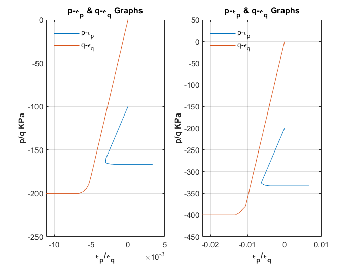


To calculate the material parameters K and G of the classical elastic perfectly plastic Mohr-Coulomb model for dry sands the following formulas obtained from intermediate theory of solid mechanics are used,  \& . Since these parameters are independent of stress conditions or stress configurations to which a given soil or mechanical body is subjected to, any stress configuration or in our case row of data from both available triaxial tests datasets can be used. Hence extracting data from row 2 of triaxial test dataset 1, \&  can be calculated and are found to be equivalent to:


>  MPa


>  MPa


## Question 2


***"Determine Young’s modulus and Poisson’s rate"***


From the section titled "**Question 1**" the values obtained for  can be used to determine the young's modulus and poisson's rate of the classical elastic perfectly plastic Mohr-Coulomb model for dry sands. It is known that the relationship between  and  consist of:


Reaging the equations given above and writting them in to a matrix format and computing for the unknowns (or variables of interest) yields:


>  MPa


## Question 3


***"Determine the value of M for the Mohr Coulomb model based on the data and calculate the friction angle"  ***


To calculate the value of M for the Mohr Coulomb model it is first necessary to evaluate the curve describing the relationship between  \&  and from there calculate the slope of said graph which is equivalent or equal to M. Two  relationship curves for the two triaxial tests data sets (although it is worth stating here that M, being a material parameter, is independent of stress conditions or configurations the material is subjected to) are shown below: 


```matlab:Code
plotfunc2(q,p)
```


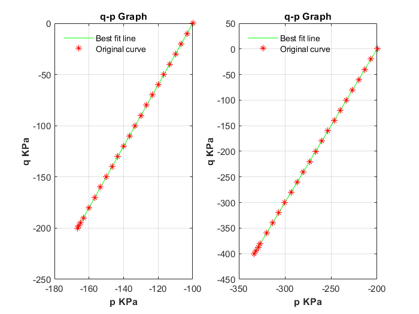


Through the use of programming language such as MATLAB, the polynomial or equation of the best fit line can be obtained, these have the form of:


Where  is equivalent to the mean stress values obtained from the th triaxial test dataset the same is true for . Once again it worth stating that the slope or M value for both datasets or graphs are identical, because M being a material parameter is indenpendent of stress configuration the material or model is subjected to.


Finally computing the value of M yields a row vector with dimensions 2x1 representing the slope or M values for the two identical graphs


```matlab:Code
M=Mcalcfunc(q,p)
```


```text:Output
M = 2x1    
    3.0000
    3.0000

```


Once the value of M has been calculated using the formula given below:


The value of (friction angle) is given by:


```matlab:Code
phi=phicalcfunc(M)
```


```text:Output
phi = 90.0000
```

## Question 4


***"Draw the Mohr’s circle for the stress state when the material fails for *** ***and ****** kPa and determine the friction angle based on the *** ***figure " ***


To draw the mohr circle and determine the line at which the combinition of normal and shear stresses need to be keept under, the last rows of data from the two distinct triaxial tests datasets were used resulting in the graph shown below. Although multiples attempts were made to infer or deduce the values of the friction angle and of the cohesion magnitude of the model correctly from the  relationship curve touching both circles (shown below), closed examation of the figure by the author revealed that the straight line still crossed both circles slightly at the points these appear to intersect which in turn resulted in a friction angle  and a soil cohesion magnitude of:


Once again the author attributes the reason for such values and the difference between the  value calculated in the section tiled "**Question 3**" and the  value calculated in this section to a imperfect attempt of inferenring at which points on the two circles the  line or curve touches. 


```matlab:Code
plotfunc3(inputdat)
plotfunc4
```


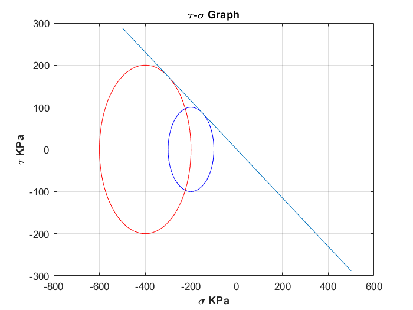

## Question 5


***"Determine the F ****** failure envelope for the problem shown in Figure 2, show the different failure modes, and discuss the pros and cons of using limit analysis method for the stability analysis of the concerned problem. (The unit weight of sands is 18 kN/m 3 and the weight of the foundation is neglected)"  ***


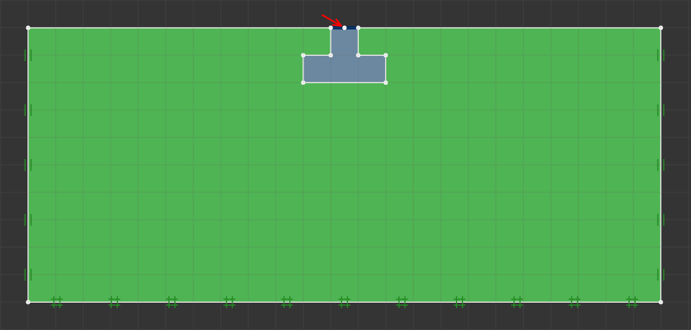


> Optum G2 Model


To solve this problem a model of the shallow foundation subjected to a force positioned at various angles (angle measured from the positive y axis) was created in OPTUM G2


The model consisted of dimensions along with material parameters which were given in the problem brief and question 5. As per our last analysis seen in the section titled **"Question 4"**, for the variables of c(soil cohesion) and (friction angle) the following values were given:


 


The only exception was the extended width (in this case the with  between the boundary of the embeded foundation and the right or left boundaries of the 2 dimensional soil region) of the two soil columns sperated by the embeded foundation and the height of the soil 2 dimensional region to which a value equivalent to 10m was attributed (considering that the values for these were not provided). Meaning the model possessed an overall height of 10 m and an overall width (including the width of the embeded foundation) of 23 m.


A limit analysis was performed in order to obtain a value for the load at which the foundation fails or the system fails, the analysis consited of 9 stages, with the first stage consisting of a mutiplier cocentrated force of the type unfavourable and permant category at an angle of -90 (measured from the positive y axis), then for the second stage the load was placed at an angle of -60,and for the remaining stages the load was place at angles of -45, -30, 0, 30, 45, 60, 90, -110, 110, -150, 150, and 180 degress each making use of elements that lead to far less conservative values for the variables of interest termed **lower elements**. Additionally the analysis consisted also of an adaptive mesh which initially started with 1000 elements and increased to 4000 elements in 4 iterations where the mesh refinement was controlled by the shear dissipation of the model. The results of the analysis are given below. 


```matlab:Code
printoptumdat(optumdat)
```


```text:Output
       Test No                 Angle         Collapse Multiplier Load
        1.00000              -180.00000                77.07200
        2.00000              -150.00000                70.34000
        3.00000              -110.00000                76.47300
        4.00000               -90.00000                94.13100
        5.00000               -60.00000               187.08200
        6.00000               -45.00000               330.80200
        7.00000               -30.00000               728.46300
        8.00000                 0.00000              4113.95600
        9.00000                30.00000               727.50700
       10.00000                45.00000               330.69000
       11.00000                60.00000               185.99400
       12.00000                90.00000                94.08100
       13.00000               110.00000                76.46100
       14.00000               150.00000                70.42600
       15.00000               180.00000                77.07200
```

  

```matlab:Code
plotfunc5(optumdat)
```


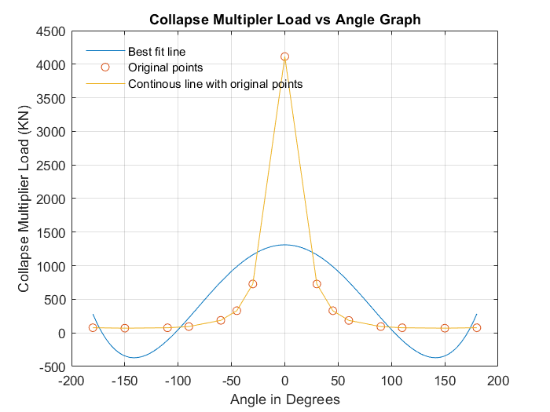


From the results demonstrated above it can be seen that when the load acts at 0 degress from the positive y axis, in other words, the force acts in the vertical direction and not at an oblique direction, the system or the soil has or demonstrates more resistance, this may be because at an oblique angle the force subjects the foundation to additional loading conditions such as a moment and axial forces which in turn reduce the resistance of the soil to loading.


Additional results and insights about the problem can be obtained by examining the volumetric/shear strain fields as well as the mean/shear stress fields of the most critical state (the condition with the lowest collapse multiplier). These are given below


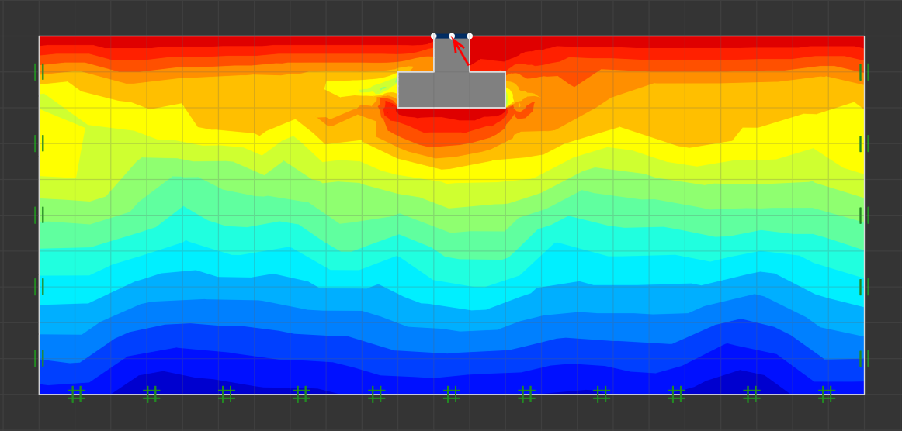


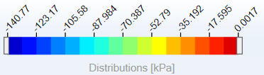


> Models' Mean Stress Field


  


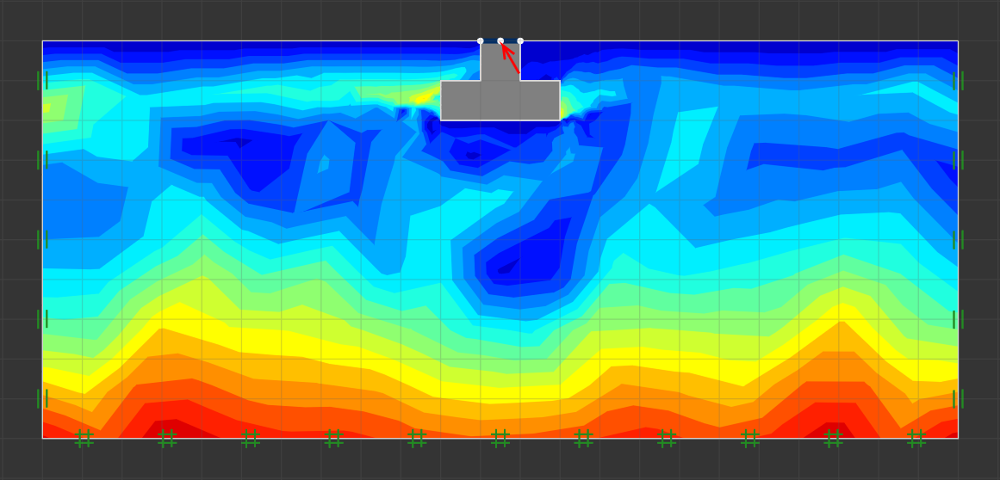


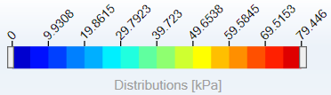


> Models' Shear Stress Field


  


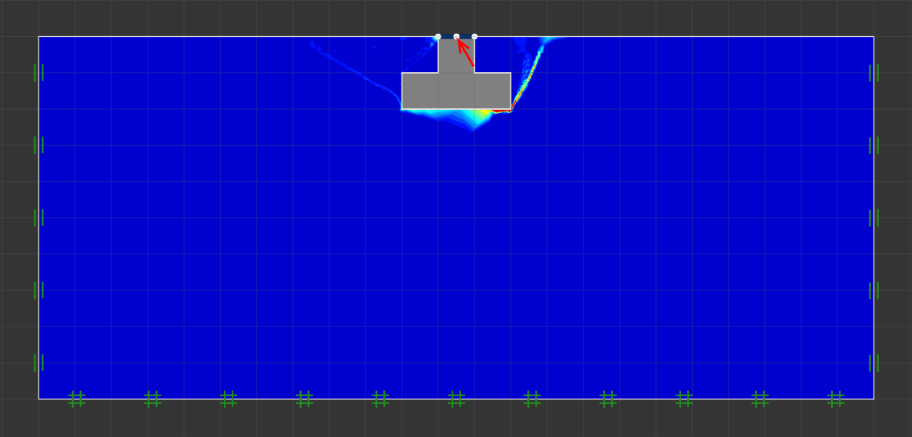


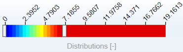


> Models' Volumetric Strain Field


  


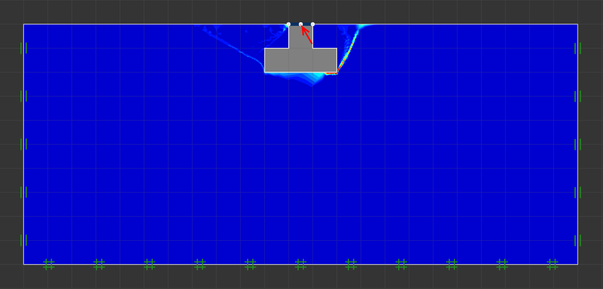


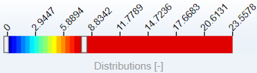


> Models' Shear Strain Field


  


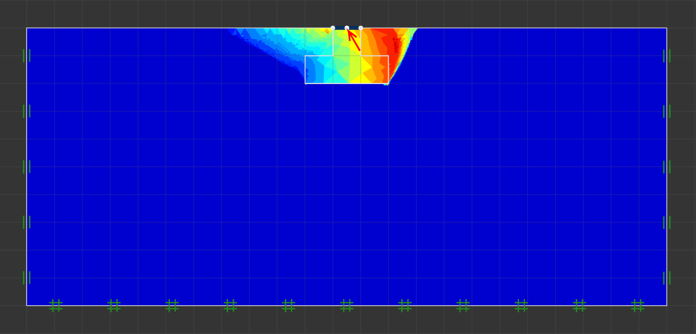


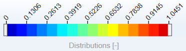


> Models' Displacement Maginuted Field 


  
### Limit Analysis as Method to Determine the Collapse Load Multiplier Magnitude


It is the author understanding that limit analysis can be defined as the method of introducing a coefficient (widely known as the Collapse Load Multiplier) to the external load being applied to the system, and dividing it (reference to ) by the maximum force that the system can support with the end goal of determining at which value of the collapse Multiplier does this ratio (reference to ) is equivalent to 1.


 Some of the pros of the limit analysis method consist of:


   1.  As opposed to limit equilibrium the need of presupposing or establishing an appropriate failure mechanism in advance is not required 
   1.  It is also not rquired that the combination of shear and normal stresses which define the strenght of a particular soil be known in advanced or before limit analysis is performed.  


Some of the cons of the limit analysis method consist of:


   1.  The need to perform multiples analysis if various parameter charactericts are changed, this is because limit analysis is sensitive to the caharacteristics of the parameters that define a given problem. An example of such a disadvamtage is the analysis performed above in which by changing the angle at which the load acts (parameter characteristic) multiples analysis were required to determine the new value of the collapse multiplear as a result of the angle change. 
   1.  Limit analysis, like most of the analytical methods and techniques avalaible in engineering does not take into account the inherent uncertainty present in calculation of soil parameters such as , , and  (this is evident in real design situations by the need to introduce factors such as the ones found in the Eurocode Design Guidelines) which if ignored could lead to incorrect results for the collapse load multiplier. 

## Appendix 


The .m file or MATLAB function found below reads or extracts the data from the spreadsheet file containing the triaxial tests data and writes it to a matrix variable which is returned by the function.


```matlab:Code
function [outputArg1,outputArg2]=trialtestdat0

tempvar=path;
path(tempvar,'C:\Users\rodin\OneDrive\Documents\Advanced Geomechanics\Coursework1\Matlab Code')
outputArg1(:,:,1)=xlsread('TriaxialTestDataCourseWork01','Test1');
outputArg1(:,:,2)=xlsread('TriaxialTestDataCourseWork01','Test2');
outputArg2(:,:,1)=xlsread('TriaxialTestDataCourseWork01','Optum_Results');

end

function printdat(inputArg1)

[r,~,n]=size(inputArg1);

for i=1:n
    tempvar=sprintf('             Test %d\n',i);
    fprintf(tempvar)
    for j=1:r
        fprintf('%8.5f  %8.5f  %8.5f   %8.5f\n',...
        inputArg1(j,1,i),inputArg1(j,2,i),inputArg1(j,3,i),inputArg1(j,4,i))
    end
end

end

```


The .m file or MATLAB function fouund below prints and returns the values of  from the data extracted from the spreadsheet file containing all the triaxial tests data.


```matlab:Code

function[outputArg1,outputArg2,outputArg3,outputArg4]=invcalcfunc(inputArg1)

[r,~,n]=size(inputArg1);
outputArg1=zeros(r,n);
outputArg2=zeros(r,n);
outputArg3=zeros(r,n);
outputArg4=zeros(r,n);

for i=1:n
    outputArg1(:,i)=(1/3)*(inputArg1(:,2,i)+2*(inputArg1(:,1,i)));
    outputArg2(:,i)=inputArg1(:,4,i)+2*(inputArg1(:,3,i));
    outputArg3(:,i)=inputArg1(:,2,i)-inputArg1(:,1,i);
    outputArg4(:,i)=(2/3)*(inputArg1(:,4,i)-inputArg1(:,3,i));
end

for i=1:n
    fprintf('                    Test %d\n',i)
    for j=1:r
        fprintf('%8.5f  %8.5f  %12.5f  %13.5f\n',...
            outputArg1(j,i),outputArg2(j,i),outputArg3(j,i),outputArg4(j,i))
    end
end

end
```


The .m file or MATLAB function found below generates the  \&  relatinship curves shown in the section titled ***"Question 1".***


```matlab:Code
function plotfunc1(inputArg1,inputArg2,inputArg3,inputArg4)

c=size(inputArg1,2);

figure(1)
clf
for i=1:c
    subplot(1,2,i)
    plot(inputArg2(:,i),inputArg1(:,i))
    hold on 
    plot(inputArg4(:,i),inputArg3(:,i))
    xlabel('\bf\epsilon_{p}/\epsilon_{q}')
    ylabel('\bfp/q KPa')
    title('p-\epsilon_{p} & q-\epsilon_{q} Graphs')
    legend('p-\epsilon_{p}','q-\epsilon_{q}','Location','northwest')
    legend('boxoff')
    grid on 
end

end
```


The .m file or MATLAB function found below generates the plot for the curve describing the relationship between .


```matlab:Code
function plotfunc2(inputArg1,inputArg2)

[~,c]=size(inputArg1);

for i=1:c
    tempvar=polyfit(inputArg2(:,i),inputArg1(:,i),2);
    y=polyval(tempvar,inputArg2(:,i));
    figure(2)
    subplot(1,2,i)
    plot(inputArg2(:,i),y,'g')
    hold on 
    plot(inputArg2(:,i),inputArg1(:,i),'*r')
    xlabel('\bfp KPa')
    ylabel('\bfq KPa')
    title('\bfq-p Graph')
    legend('Best fit line','Original curve','Location',"northwest")
    legend('boxoff')
    grid on 
end

end
```


The .m file or MATLAB function found below calculates the value of M (or in other words the slope of the curve describing the relationship between ) by using the numerical analysis technique known as central difference method.


```matlab:Code
function[outputArg1]=Mcalcfunc(inputArg1,inputArg2)

outputArg1=zeros(2,1);

c=size(inputArg1,2);
h=0.2;

for i=1:c
    coeffi=polyfit(inputArg2(:,i),inputArg1(:,i),1);
    tempvar=randi(size(inputArg1,1));
    outputArg1(i,1)=(polyval(coeffi,inputArg2(tempvar,i)+h)-...
        polyval(coeffi,inputArg2(tempvar,i)-h))/(2*h);
end
```


The .m file or MATLAB function found below calculates the value of  by making use of the formula which  describes the relationship between  \& M.This has the form of .


```matlab:Code

end

function [outputArg1]=phicalcfunc(inputArg1)

outputArg1=asind((3*inputArg1(1,1))/(inputArg1(1,1)+6));

end
```


The .m file or MATLAB function found below generates two mohrs circles plots and a  line which touches or intercepts both circles.


```matlab:Code

function plotfunc3(inputArg1)

[r,~,n]=size(inputArg1);

indx=r;

for i=1:n
    sigma1=max(inputArg1(indx,1:2,i));
    sigma2=min(inputArg1(indx,1:2,i));
    rad=(sigma2-sigma1)/2;
    c=sigma1+rad;
    x=linspace(sigma1,sigma2,1001);
    y=sqrt(rad^2-(x-c).^2);
    if i==1
        tempvar='blue';
    else
        tempvar='red';
    end
    figure(3)
    if i==1
        clf
    end
    plot(x,y,tempvar,x,-y,tempvar)
    xlabel('\bf\sigma KPa')
    ylabel('\bf\tau KPa')
    title('\tau-\sigma Graph')
    hold on
    grid on
end

end

function plotfunc4

warning off

%the following points were obatined through trial and error 
tempvar1=[-151.4009;-304.0013];
tempvar2=[87.3973;175.4559];

coeffi=polyfit(tempvar1,tempvar2,1);

x=linspace(-500,500,500);
y=polyval(coeffi,x);
figure(3)
plot(x,y)

end
```


The .m file or function given below prints the data compiled by the author and obtained from the Optum G2 analysis of the problem which can be seen in section titled "**Question 5**".


```matlab:Code
function printoptumdat(inputArg1)

r=size(inputArg1,1);
fprintf('       Test No                 Angle         Collapse Multiplier Load\n')

for i=1:r
    fprintf('%15.5f         %15.5f         %15.5f\n',inputArg1(i,1),inputArg1(i,2),inputArg1(i,3))
end

end
```


The .m file or MATLAB function found below plots the  envelope curve.


```matlab:Code
function[]=plotfunc5(inputArg1)

coeffi=polyfit(inputArg1(:,2),inputArg1(:,3),5);
x=linspace(min(inputArg1(:,2)),max(inputArg1(:,2)),500);
y=polyval(coeffi,x);
figure(4)
clf
plot(x,y,inputArg1(:,2),inputArg1(:,3),'o',inputArg1(:,2),inputArg1(:,3))
xlabel('Angle in Degrees')
ylabel('Collapse Multiplier Load (KN)')
title('Collapse Multipler Load vs Angle Graph')
legend('Best fit line','Original points',...
    'Continous line with original points','Location','northwest')
legend('boxoff')
grid on 

end
```

